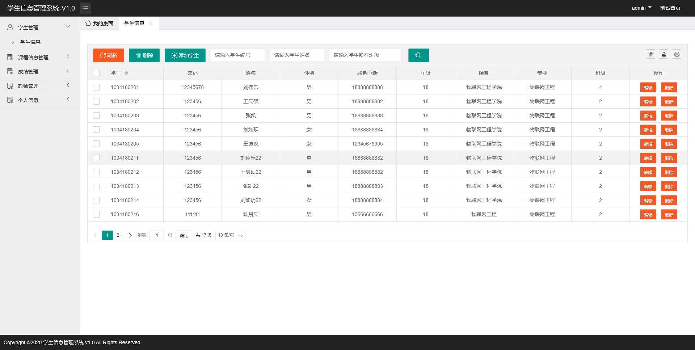

## 学生管理系统(Student Manage System)

### 项目概述
这是我为了熟悉SSM框架写的一个学生管理系统, 是SSM的一个入门项目. 前端用的[Layui框架](https://www.layui.com/), 很多前端代码都是借鉴别人的. 

预览地址：http://sms.akwing.cn:8080/sms

- 开发工具： Intellij IDEA 2020.1.1(Ultimate Edition) 
- Java版本：Java8
- Tomcat版本：Tomcat 9.0.38
- mysql版本：mysql8.0.20

### 项目功能
该学生管理系统可以由三类角色登录：管理员，教师和学生。

功能有 
- 学生管理
- 教师管理
- 课程管理
- 选课管理
- 成绩查询
- 修改个人信息

管理员具备所有功能，教师能管理学生，管理自己的课程以及修改分数，学生只能查看自己的选课和成绩。

### 项目截图

#### 登录界面

#### 系统主界面

#### 学生管理界面

#### 添加学生信息

#### 修改学生信息

#### 查询学生

姓名是模糊查询

#### 课程管理界面

#### 选课管理界面

#### 成绩管理界面

#### 教师管理界面

#### 个人信息修改界面

